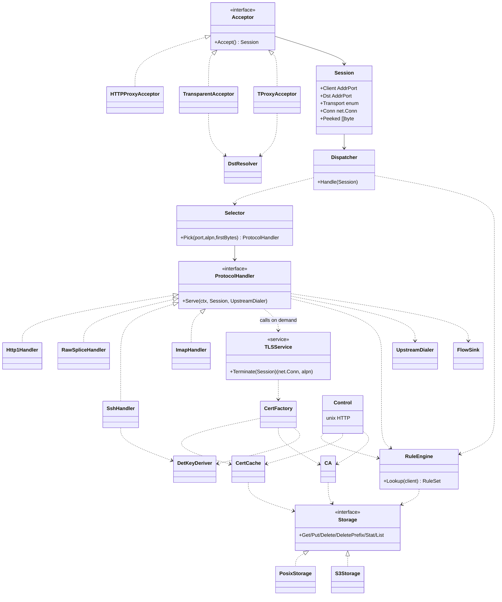

# mitmania — design

This document is the architecture rationale for contributors: what the system is, the property everything else is organized around, and the *why* behind decisions that aren't obvious from the code. It is not user documentation — for installation, configuration reference, tutorials, and operational guides, see [docs.mitmania.com](https://docs.mitmania.com/).

## Scope

An intercepting HTTP/HTTPS proxy with on-the-fly certificate generation, for inspecting and mutating traffic from LXC/VM/Docker clients. Explicit proxy and transparent (nft/iptables) modes. Extensible to other protocols (SSH, IMAP) without touching the core.

**v1** (the only planned target): HTTP/1.1 + HTTPS MITM (+ WebSocket) + HTTP/2, explicit and transparent (redirect/tproxy) TCP, cert cloning with deterministic keys, pluggable `Storage` (posix/s3), rule engine + egress policy, control socket, OpenTelemetry metrics and traces. v2/v3 are design-space notes only (see Extensibility), not a backlog.

**Non-goals**: a general-purpose reverse proxy; a packet firewall (mitmania is not the containment boundary — a firewall must still prevent clients reaching the network directly); revocation propagation (OCSP/CRL are stripped from clones, not reproduced); untrusted-root propagation (a chain that only failed because its anchor is untrusted becomes trusted under mitmania's own root — documented, not fixed in v1).

## The core property: horizontal scale-out with near-zero per-node state

Every node is stateless and interchangeable. All shared state — the signing CA, the leaf-cert cache, and every client's rules — lives in one `Storage` backend (S3 for a real cluster). The only out-of-band secret is `clusterKey`, which bootstraps trust and key derivation. A node's own inputs are just: the storage URL, `clusterKey`, and its listener addresses.

This is deliberate, not incidental: private leaf keys are *derived*, never shared (HKDF over `clusterKey` + the leaf's SAN set — see Certificates below), so no key material moves between nodes. The CA is a byte-identical blob copied to every node. Rules and the leaf-cert cache propagate through `Storage`'s own change-versioning, with no node-to-node RPC, no gossip, no distributed lock, no leader, and no generation counter — **eventually consistent by design**, converging through content-addressing and verify-on-load rather than coordination.

Front a fleet with an L4 load balancer: a source-preserving one (DSR / transparent) keeps per-client-IP identity directly; behind a SNAT balancer, recover the real client IP via `--trusted-proxies` + `X-Forwarded-For` on explicit listeners, or gate access with proxy-auth instead of relying on source IP at all.

## Entity model

- **Acceptor** — the only layer aware of transport; fills `Session{Client,Dst,Conn}`. Three implementations (explicit, TPROXY, REDIRECT).
- **Dispatcher** — transport-agnostic; selects the handler and never terminates TLS itself.
- **ProtocolHandler** — the extension seam. Owns the decision of whether/when to call `TLSService`. `Http1Handler` owns HTTP/2 too, rather than a separate handler: h2 vs. h1 is a per-connection ALPN outcome known only after `TLSService.Terminate`, not something `Selector` can route on ahead of time.
- **TLSService** — an on-demand service (not a fixed pipeline stage), so STARTTLS-style mid-stream handlers can call it too.
- **CertFactory / CertCache / CA / DetKeyDeriver** — shared certificate machinery, reused by every protocol.
- **Storage** — the pluggable state backend behind `CertCache`, `CA`, and `RuleEngine`; `PosixStorage`/`S3Storage` in v1.

## Request pipeline (TLS → HTTP/1)

1. Acceptor produces `Session{Client, Dst}`.
2. Dispatcher/Selector picks `Http1Handler`; it parses the CONNECT or absolute-form authority.
3. **(Explicit listeners only)** the proxy-auth gate runs, if the rule file requires it — before any rule match, before any dial.
4. Connection-phase rule match (host/port/proto) runs **before any upstream dial**: no match → `511` without opening a socket; `mitm:false` → a raw splice to that exact authority.
5. For intercepted CONNECT: peek the ClientHello for SNI/ALPN, and require SNI (when present) to equal the already-authorized CONNECT host — an approved SNI must never authorize a different socket destination.
6. `TLSService.Terminate` dials upstream, clones its certificate via `CertFactory`, and completes the client-facing handshake — offering `h2` to the client only when upstream itself negotiated `h2`.
7. The request is read, egress-checked against the resolved destination, rule-matched again at message phase, mutated per its `request[]`/`response[]` pipeline, forwarded, and logged.

Framing and memory bounds are owned by the protocol handler, not the core — the core provides only bounded-reader/streaming primitives. Bodies are always streamed, never fully buffered.

## Certificates

Every synthetic leaf is a **clone**, not a fresh cert: Subject, full SAN set (order preserved), validity (`notBefore`/`notAfter`), KeyUsage, ExtKeyUsage, and BasicConstraints are copied verbatim from the real chain; embedded SCTs, AIA-OCSP, and CRLDP are stripped (unforgeable, or they'd point at the real CA and break strict clients); AuthorityKeyIdentifier, SubjectPublicKeyInfo, and serial are recomputed.

**The proxy must not launder trust.** Validity is followed exactly at every level of the chain, so an expiry or not-yet-valid cert surfaces to the client identically to the real thing — by construction, not by special-casing. That means reproducing a chain means generating the *entire* chain (leaf + every intermediate), not just the leaf, each element re-signed up the synthetic chain to mitmania's own root.

**Keys are derived, never stored.** `d = (HKDF(ikm=clusterKey, salt, info, L=48) mod (n-1)) + 1`, salted on the sorted, type-tagged SAN set (`dns:`/`ip:`, so a DNS name that looks like an IP literal can never collide with an actual IP SAN). Same `clusterKey` + same SAN-set identity → the identical key on every node, with no key ever crossing the wire. A cache hit re-derives the key and checks it against the cached cert's public key before serving — the "verify-on-hit" step that makes a `clusterKey`/CA change self-heal per node without a generation counter.

**Bring-your-own signing CA.** Instead of the auto-generated throwaway root, an operator can supply their own — typically a sub-CA issued by the org's real root, so clients that already trust it need nothing installed. The bundle is validated fully at load (ECDSA P-256/P-384 signing key, `CA:true`+`keyCertSign` both critical, key↔cert match, currently valid, and — if not self-signed — a verified chain up to a self-signed root). An intermediate (or a root with a `pathLenConstraint`) can't always reproduce a real chain's full depth: when the real chain is deeper than that budget, mitmania **flattens** to direct leaf issuance and clamps the leaf's `notAfter` to the signing CA's own — a CA can't vouch for a cert outliving it. `NameConstraints`/`ExtKeyUsage` on the signing CA are enforced by the client, not bypassed: an out-of-scope leaf is rejected client-side, which is the point — the org bounds mitmania's reach inside its own PKI.

Full detail (recipes, validation rules, chain fidelity trade-offs) lives in the docs site; this is the shape of the decision, not the procedure.

## Storage & consistency

`Storage` is a flat, content-addressed blob interface (`Get`/`Put`/`Delete`/`DeletePrefix`/`Stat`/`List`) — `posix://` and `s3://` in v1. Three things live behind it: the CA (`ca/ca.p12`), the leaf-cert cache (`leaf/certs/{id}`, content-addressed by a fingerprint of the real chain — not `SANs+serial`, which collide across issuers and erase SAN type), and rules (`rules/ip/{addr}`, `rules/default`).

**No cache TTL, no separate freshness check.** MITM dials upstream on every connection anyway, so the real chain is observed for free each time; a renewal is simply a different chain fingerprint, hence a different cache id, hence a natural cache miss. **Verify-on-hit** is the actual correctness guard, not a generation counter: before serving any cached chain, a node re-derives the leaf key and confirms it still chains to the *current* CA — a CA or `clusterKey` change is caught here even if the best-effort `leaf/` wipe (triggered by a `.tuple` fingerprint mismatch, hashed over the *full* signing cert so a same-key re-issuance is caught too, not just its public key) missed a straggler somewhere in the fleet. Concurrent writers minting the same real chain compute the same id and each `Put`s a semantically-equivalent (not byte-identical — ECDSA signing is nondeterministic) cert; last-write-wins is harmless because both are valid.

## Rule engine

Rule *addressing* is exactly two kinds, both pure functions of network facts — **mitmania is a data-plane for proxying**, so which rule file governs a connection never depends on an authenticated principal or any other application-layer identity:

1. **Per-address override** (`rules/ip/{addr}`) — an exact match for one client.
2. **Default table** (`rules/default`) — one blob mapping addresses/masks to the same rule-file shape; every client without an override resolves here. Its one hard obligation: the ordinary-prefix entries (v4 together, v6 together) must gaplessly cover the full address space, checked at save time — an incomplete table is rejected outright. A sparse (non-contiguous) mask is accepted alongside ordinary prefixes for structured addressing a prefix can't express (e.g. a service field encoded in fixed, non-leading bytes); entries rank by mask value descending — a single comparison that subsumes longest-prefix-match and lets a sparse mask deliberately outrank a broader prefix. Sparse entries are pure overrides, exempt from the coverage obligation in both directions.

Within one file, `http[]` is iptables-like: rules evaluated top-down, first match wins, exactly one pipeline runs — no cascading. `egress[]` (destination-address policy, the SSRF guard) is a second, independent ordered list over the same connection; both must pass. A hard, non-overridable guard denies any destination resolving to mitmania's own listener or control addresses, regardless of what a client's `egress[]` says — otherwise a broad `allow` could let traffic loop back and rewrite shared rules cluster-wide.

**Client authentication (`auth.http_proxy`) is a gate, never a rule-selection mechanism.** A successful credential authenticates the connection and is recorded for attribution, but the rule file that already governed the connection-phase lookup stays effective start to finish. This follows directly from the data-plane principle above: identity-driven rule re-keying was considered and deliberately rejected, since it would make policy depend on something other than network facts.

**Outcalls** (`webhook`/`header.fetch`) let a rule ask an external broker mid-request — the one place the rule pipeline stops being pure/instantaneous, so everything about them exists to bound that: no retries on `webhook` (a repeated ask is a duplicated decision), freshness left entirely to the broker's own HTTP caching headers (mitmania has no TTL of its own), and a load-time probe that validates a broker-carrying rule by actually calling it — the probe's own response is discarded, never seeding the serving cache, since a synthetic probe-allow silently authorizing the first real request would be a straightforward bypass.

## Telemetry: stealth by default

Consistent with never announcing the proxy: no `traceparent` is injected into forwarded upstream requests by default (that would mutate client traffic and reveal a middlebox — `--otel-propagate-upstream` opts in), and a client-supplied `traceparent` is ignored for parenting by default (a client shouldn't drive the proxy's own trace ids or sampling — `--otel-continue-client` opts in). mitmania's own dependencies — broker outcalls, `s3://` storage calls — always carry `traceparent` regardless, since correlating their latency is the point of tracing them.

## Extensibility

| New protocol | Adds | Reuses unchanged |
|---|---|---|
| SSH (tcp) | `SshHandler`, own outcall envelope section, own `auth.ssh` mechanism | Acceptors, Session, Dispatcher, UpstreamDialer, Storage |
| IMAP (tcp, STARTTLS) | `ImapHandler` (calls `TLSService` mid-stream), own outcall envelope section, own `auth.imap` mechanism | `TLSService`, `CertFactory`, transport, Storage |
| New state backend | A `Storage` implementation (`redis://`, `postgres://`, …) | Everything above the interface |

SSH MITM is host-key substitution, not cert cloning, so it trips `known_hosts` pinning — only viable on TOFU or a pre-provisioned host key.

---

For everything else — CLI flags, the rule JSON schema, the control API, deployment topologies, security hardening, tutorials — see [docs.mitmania.com](https://docs.mitmania.com/).
