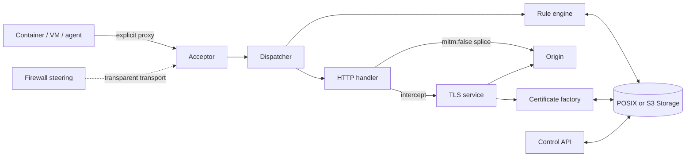

# What mitmania is

mitmania sits between a proxied client and its outbound destinations. It first identifies the client, then selects an effective rule file, authorizes the connection and resolved addresses, and either splices the tunnel or intercepts HTTP traffic.

It is a **data plane**: rule selection is a pure function of the client's network address, never of who authored the policy or why. mitmania carries and enforces traffic; deciding what the rules should say is a [control plane](control-plane.md)'s job — a human with `curl`, a GitOps reconciler, or an external policy engine reached through an outcall.

An **explicit** client knows it is using a proxy and sends `CONNECT` or absolute-form HTTP. A **transparent** deployment uses firewall steering and recovers the original destination. In either transport, `mitm:false` leaves TLS end-to-end; MITM terminates both TLS legs so message-phase policy can run.

!!! note "Current v1 implementation"
    Explicit HTTP, TLS-terminated explicit, and transparent REDIRECT/TPROXY listeners all ship (the latter two Linux-only). SSH, IMAP, HTTP/3, Redis, and PostgreSQL are design-space, not shipped features.

Next: [follow the request pipeline](pipeline.md) or [run without MITM](../usecases/no-mitm.md).

