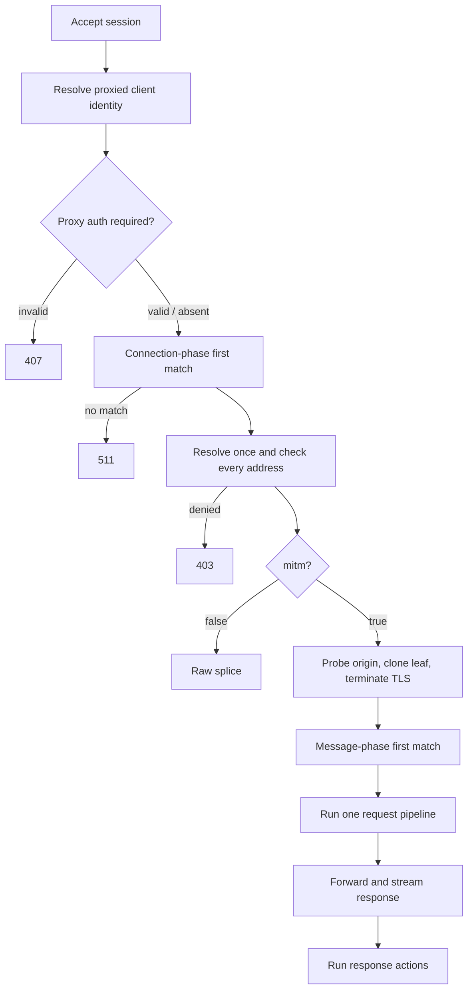

# Request pipeline

Each connection passes through two independent policy questions: does a connection-phase rule authorize this authority, and does egress policy authorize every resolved address? Only intercepted traffic proceeds to message-phase rules.

The same ordered `http[]` list is scanned twice. The connection pass sees only `host`, `port`, and `proto` and decides whether to intercept. After interception, the message pass can also see `path`, `method`, and headers and runs exactly one rule's action pipeline.

Rules are first-match, not cumulative. A broad rule placed first can make every narrower rule dead. Egress is a separate first-match list over pinned destination IPs; both lists must allow the connection.

See [Matching and actions](../config/actions.md) for field semantics and [Error pages](../config/errors.md) for rejection delivery.

